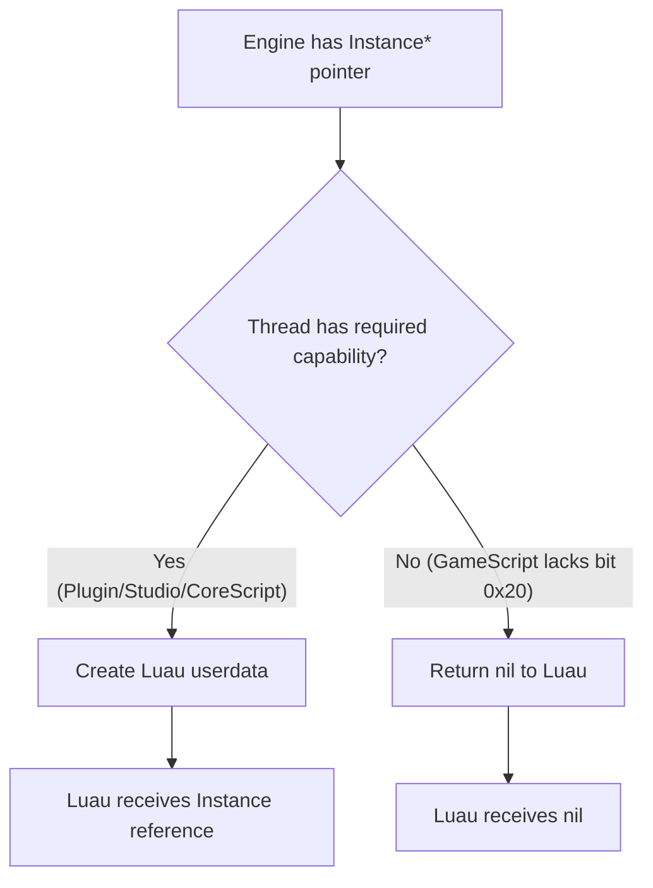

# Mirage
Creating Freezer Instances such as Lightning, Camera, Teams, denies the replication of the Parent property of an instance on client side.

How does this happen? Well we need look into C++ level to understand it

First we need understand a Roblox capability called **NotAccessible**.
NotAccessible is a capability that controls whether scripts can obtain a userdata reference.
When a thread lacks this capability and tries to access a instance with NotAccessible or its descendants, the engine returns nil.

Then we get to Lightning, Teams.
They have a flag called NotReplicated enabled on them.
When the server creates a clone, it exists in server memory but the replication filter sees NotReplicated and blocks it from being serialized to clients.

There is also another type of Mirage, aka RobloxLocked, The difference? RobloxLocked doesn't have a userdata reference on **Serverside** and **Client** the result of NotAccessible. (unless u have a extremely high identity) This lets people to hide scripts and remotes without fear of being seen.

There are more types of Mirage (GreenFN, ReverseGreenFN) those wont be mentioned here.



What isn't explained in Dark Arts is that this is how you can create a **dereplicated** remote.

```lua
workspace.DescendantAdded:Connect(function(v)
    if v:IsA("RemoteEvent") then
		task.wait(5)
        v:FireServer() -- this will fire even in mirage but needs to be replicated where client can get a reference
    end
end)
``` 
Dereplictaed remotes meaning u can fire remotes that arent viewable in datamodel.

Have a freezer and a model inside freezer and parent remote in workspace then model inside freezer.
If u get a userdata reference of RemoteEvent u are able to call it even if its parented to a Freezer because the userdata is cached and no longer tries to create a new reference so it bypasses the **NotAccessible** check.


Fun fact if u just parent anything into a freezer those arent counted in getnilinstance() so u could hide things u dont want exploiters to see using Mirage.

U might be asking how on earth do u create Lightning or Teams. Well 3 main ways
1. Patching Roblox Studio in memory
2. Using Serialization Service
3. Creating a RBXMX and uploading it and requiring module

Only going to be explaining SerializationService method because its easiest.
This just a RBXM that gets loaded by SerializationService.
```lua
local s = game:GetService("SerializationService")
local enc = game:GetService("EncodingService")

local data = "PHJvYmxveCGJ/w0KGgoAAAIAAAACAAAAAAAAAAAAAABNRVRBJAAAACIAAAAAAAAA8BMBAAAAEgAAAEV4cGxpY2l0QXV0b0pvaW50cwQAAAB0cnVlSU5TVBkAAAAXAAAAAAAAAPAIAAAAAAYAAABGb2xkZXIAAQAAAAAAAABJTlNUHAAAABoAAAAAAAAA8AsBAAAACAAAAExpZ2h0aW5nAQEAAAAAAAACAFBST1AiAAAAIAAAAAAAAADwEQAAAAATAAAAQXR0cmlidXRlc1NlcmlhbGl6ZQEAAAAAUFJPUB8AAAAdAAAAAAAAAPAOAAAAAAwAAABDYXBhYmlsaXRpZXMhAAAAAAAAAABQUk9QHwAAAB0AAAAAAAAA8A4AAAAAEwAAAERlZmluZXNDYXBhYmlsaXRpZXMCAFBST1AqAAAAKAAAAAAAAADwGQAAAAAEAAAATmFtZQEXAAAAY29uZ3JhdHMgbWFkZSBsaWdodG5pbmdQUk9QIAAAAB4AAAAAAAAA8A8AAAAADQAAAFNvdXJjZUFzc2V0SWQbAAAAAAAAAAFQUk9QEwAAABEAAAAAAAAA8AIAAAAABAAAAFRhZ3MBAAAAAFBST1AeAAAAHAAAAAAAAADwDQEAAAAHAAAAQW1iaWVudAx+AAAAfgAAAH4AAABQUk9QIgAAACAAAAAAAAAA8BEBAAAAEwAAAEF0dHJpYnV0ZXNTZXJpYWxpemUBAAAAAFBST1AZAAAAFwAAAAAAAADwCAEAAAAKAAAAQnJpZ2h0bmVzcwR/AAAAUFJPUB8AAAAdAAAAAAAAAPAOAQAAAAwAAABDYXBhYmlsaXRpZXMhAAAAAAAAAABQUk9QKAAAACYAAAAAAAAA8BcBAAAAEQAAAENvbG9yU2hpZnRfQm90dG9tDAAAAAAAAAAAAAAAAFBST1AlAAAAIwAAAAAAAADwFAEAAAAOAAAAQ29sb3JTaGlmdF9Ub3AMAAAAAAAAAAAAAAAAUFJPUB8AAAAdAAAAAAAAAPAOAQAAABMAAABEZWZpbmVzQ2FwYWJpbGl0aWVzAgBQUk9QJgAAACQAAAAAAAAA8BUBAAAAFwAAAEVudmlyb25tZW50RGlmZnVzZVNjYWxlBAAAAABQUk9QJwAAACUAAAAAAAAA8BYBAAAAGAAAAEVudmlyb25tZW50U3BlY3VsYXJTY2FsZQQAAAAAUFJPUCMAAAAhAAAAAAAAAPASAQAAABQAAABFeHBvc3VyZUNvbXBlbnNhdGlvbgQAAAAAUFJPUCQAAAAiAAAAAAAAAPATAQAAABUAAABFeHRlbmRMaWdodFJhbmdlVG8xMjASAAAAAFBST1AfAAAAHQAAAAAAAADwDgEAAAAIAAAARm9nQ29sb3IMfoAAAH6AAAB+gAAAUFJPUBUAAAATAAAAAAAAAPAEAQAAAAYAAABGb2dFbmQEj4agAFBST1AXAAAAFQAAAAAAAADwBgEAAAAIAAAARm9nU3RhcnQEAAAAAFBST1AhAAAAHwAAAAAAAADwEAEAAAASAAAAR2VvZ3JhcGhpY0xhdGl0dWRlBIRN3cxQUk9QGQAAABcAAAAAAAAA8AgBAAAADQAAAEdsb2JhbFNoYWRvd3MCAFBST1AcAAAAGgAAAAAAAADwCwEAAAANAAAATGlnaHRpbmdTdHlsZRIAAAAAUFJPUBsAAAAZAAAAAAAAAPAKAQAAAAQAAABOYW1lAQgAAABMaWdodGluZ1BST1AlAAAAIwAAAAAAAADwFAEAAAAOAAAAT3V0ZG9vckFtYmllbnQMfgAAAH4AAAB+AAAAUFJPUBQAAAASAAAAAAAAAPADAQAAAAgAAABPdXRsaW5lcwIBUFJPUCUAAAAjAAAAAAAAAPAUAQAAABkAAABQcmlvcml0aXplTGlnaHRpbmdRdWFsaXR5AgFQUk9QHQAAABsAAAAAAAAA8AwBAAAADgAAAFNoYWRvd1NvZnRuZXNzBH4AAABQUk9QIAAAAB4AAAAAAAAA8A8BAAAADQAAAFNvdXJjZUFzc2V0SWQbAAAAAAAAAAFQUk9QEwAAABEAAAAAAAAA8AIBAAAABAAAAFRhZ3MBAAAAAFBST1AZAAAAFwAAAAAAAADwCAEAAAAKAAAAVGVjaG5vbG9neRIAAAACUFJPUCAAAAAeAAAAAAAAAPAPAQAAAAkAAABUaW1lT2ZEYXkBCAAAADE0OjAwOjAwUFJOVBEAAAAVAAAAAAAAADQAAgABAKACAQAAAAAAAAABRU5EAAAAAAAJAAAAAAAAADwvcm9ibG94Pg=="
local decoded = enc:Base64Decode(buffer.fromstring(data))

s:DeserializeInstancesAsync(decoded)[1].Parent = workspace
```


# Credits

This Document was written by SylveLabs (Several, Setmetatables) without use of AI

 “All men can see the tactics whereby I conquer, but what none can see is the strategy out of which victory is evolved.”  
― Sun Tzu, The Art of War
