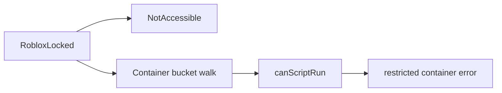
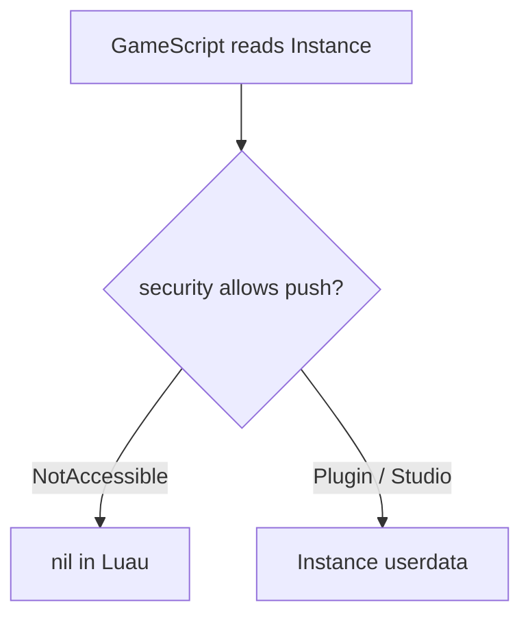
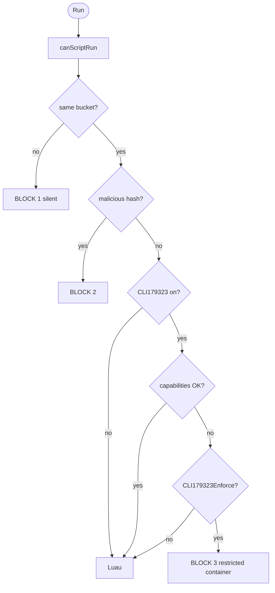

# RobloxLocked Analysis

Studio error:

> Script "Workspace..Script" was blocked from being ran under a restricted container.

**Target:** `RobloxStudioBeta.exe`  
**Build:** `version-792bc2069be7464a`

## What is RobloxLocked

**RobloxLocked** is a bool on `Instance`.

When set on an instance, **GameScript** cannot parent into it, destroy it, or hold a normal reference to it (or its subtree). **Plugin**, **Studio**, **CoreScript**, and higher contexts are not limited the same way.

The bool alone does **not** print the restricted container error. That message comes from the startup gate (`canScriptRun`) before Luau runs.



**Overview diagram steps**

**RobloxLocked** marks an instance and its subtree as protected in the data model. The flag is stored on the instance and read by both the visibility layer and the container walk.

**NotAccessible** is the capability class used when the engine refuses to push an `Instance` userdata into a low trust thread. GameScript hits this when reading properties or `ObjectValue` targets under a locked ancestor.

**Container bucket walk** resolves which security territory owns the script versus the runner. RobloxLocked on a parent changes where the upward `.Parent` walk stops, so the script may land in a different bucket than the ScriptContext.

**canScriptRun** is the native gate that runs before the VM starts. It compares buckets, checks denylists, and optionally runs capability intersection.

**restricted container error** is the Studio log when enforcement decides the script cannot start in that territory. It is not emitted by the RobloxLocked property setter alone.

## Why GameScript sees nil (cannot reference)

This is separate from startup buckets and CLI179323.

| Issue | Cause |
|-------|--------|
| `ObjectValue.Value` is nil | Engine did not push that `Instance` into the Luau thread |
| `.Parent` on locked root fails | No userdata handle, not because the DM object was deleted |

**NotAccessible** (capability bit **`0x20`**, index **5**) is the permission class tied to locked and protected instances. On this build the name decoder is around RVA **`0x2A57540`**. When push or wrap checks fail, Luau gets **nil** instead of userdata.

**RobloxLocked** storage: **`Instance + 0x18A`** (byte). Native read around **`0x6C8541`**: `cmp byte ptr [rcx+0x18A], 0`.

Do **not** trust the registered Luau getter stub at **`0x6C8530`** (`xor al, al; ret`). It always returns false to scripts. Use Studio properties or break **`0x6C8541`** with `RCX = Instance*`.

Startup **capability intersection** (RVA ~**`0x2A58DC0`**, `lacking capability` string) only decides whether the script **starts**. It does not explain nil while a script is already running.



**Nil diagram steps**

**GameScript reads Instance** covers any path that would expose an instance handle: properties, children, events, `ObjectValue.Value`, or `__index` on a reference.

**security allows push** is the native check that maps thread identity plus instance flags (RobloxLocked, NotAccessible) to allow or deny creating userdata.

**nil in Luau** means the call succeeded at the C API level but the script receives no reference, so parenting and most mutations are impossible on that object.

**Instance userdata** is the normal path for Plugin or Studio identity, where the same DM pointer is wrapped and passed into the VM.

## How does roblox block scripts inside RobloxLocked?

### 1. Property layer

RobloxLocked uses high property security (PluginSecurity class descriptors). That controls who may edit or parent in the properties sense. It is not the same as startup capability bitmasks.

### 2. Container bucket

Before Luau, the engine asks whether the script’s territory matches the runner’s.

| Term | Meaning |
|------|---------|
| **scriptContainer** | Walk **up** `.Parent` from the script to anchor |
| **contextContainer** | Same walk from **ScriptContext** |
| **Pass** | `scriptContainer == contextContainer` |

RobloxLocked on an ancestor changes which container the script resolves to. Mismatch is **BLOCK 1** (silent). A match does not guarantee the script runs.

### 3. Startup capabilities (FFlags)

| FFlag | Role |
|-------|------|
| **CLI179323** | Run capability check at start |
| **CLI179323Enforce** | If intersection fails, show restricted container error |

**RunContext → required mask** (examples):

| RunContext | Required mask |
|------------|---------------|
| Legacy (0) | `0x0` |
| Plugin (3) | `0x300000000000000B` |
| Server / Client | see RE notes |

**Stored on ScriptContext:** wide **`+0x208`**, byte **`+0x198`**.

```
wideOK = (storedWide == 0) OR ((required & storedWide) == storedWide)
byteOK = (storedByte == 0) OR ((required & storedByte) == storedByte)
PASS   = wideOK AND byteOK
```

Legacy with required `0x0` can still fail intersection if stored masks are wrong. That leads to **BLOCK 3** when enforce is on.

## Flowchart



### Run

The user triggers execution from Studio (Run, Play, or an equivalent start path). The scheduler eventually reaches **`startScript`**, which always consults **`canScriptRun`** before any bytecode runs.

### canScriptRun

This function collects the script instance, its **RunContext**, and the owning **ScriptContext**. All later checks use those inputs; nothing in Luau has started yet.

### same bucket?

The engine walks parents from the script and from the ScriptContext runner until each side has a container pointer. If **`scriptContainer != contextContainer`**, the script is in a different territory than the runner and startup stops with **BLOCK 1** (usually silent).

### BLOCK 1 silent

Blocked.

### malicious hash?

The build fingerprints the script source and compares it to a denylist on the ScriptContext. A hit is **BLOCK 2** with a malicious detection log, not the restricted container string. 

The denylist is a list of 9000+ Roblox hashes that will kill the script if detected.

### BLOCK 2

This path is unrelated to RobloxLocked visibility. It is a separate anti abuse gate on known bad script hashes.

### CLI179323 on?

When this FFlag is off, capability intersection is skipped entirely. The script may proceed if bucket and malicious checks already passed.

### capabilities OK?

When CLI179323 is on, **RunContext** selects a required capability mask. That mask is compared to the wide and byte masks stored on the ScriptContext. Both wide and byte rules must pass for intersection to succeed.

### Luau

The VM initializes and the script body runs. Reaching this node means startup gates accepted the script for this context.

### CLI179323Enforce?

If capabilities failed but this FFlag is off, Studio does not block startup for missing capabilities. The script can still be stopped earlier by **BLOCK 1** or **BLOCK 2**.

### BLOCK 3 restricted container

Intersection failed and enforcement is on. Studio blocks startup and may log the restricted container message.
**CoreScript** skips the malicious and capability branches in step 3 but still must pass the bucket compare.

## Example tree

```
Workspace
└── Folder (RobloxLocked)
    └── Script
```

Script walk: Script → locked Folder → Workspace (ServiceProvider) = **scriptContainer**.

Runner walk from **ScriptContext** must land the same pointer.

## References

- [Pseudoreality/Roblox-Identities](https://github.com/Pseudoreality/Roblox-Identities/) identity levels

---

Thanks for reading. Several and Setmetatables was here :3 baiiiiiiiiii

This was AI generated work
