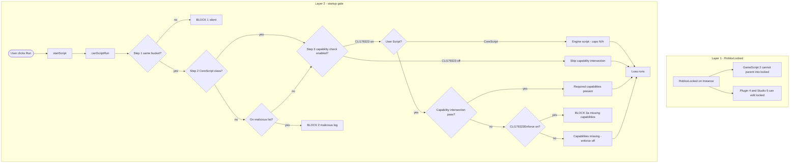
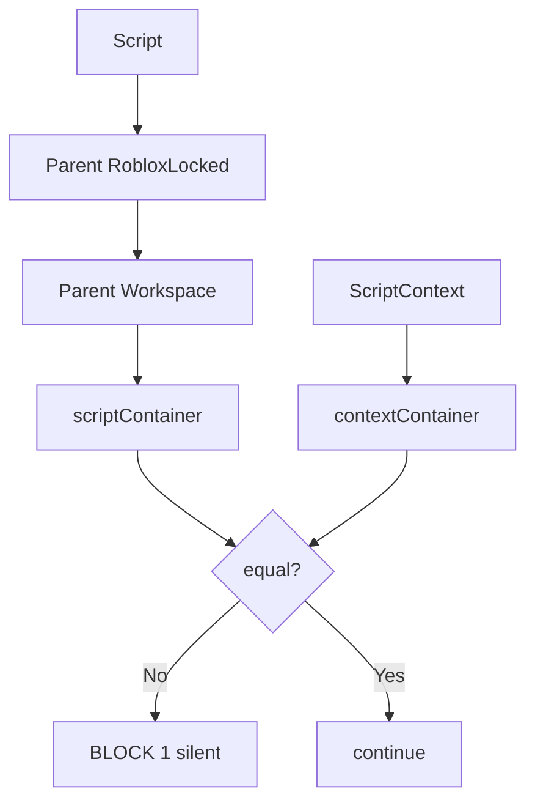
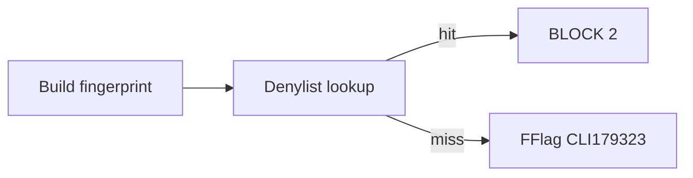
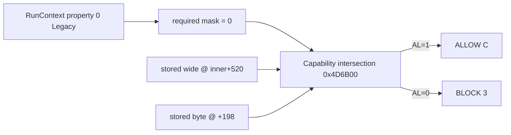
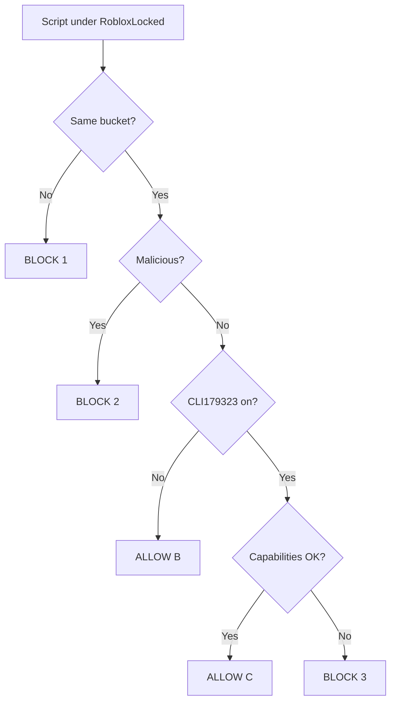

# RobloxLocked Analysis

Roblox error:

> Script "Workspace..Script" was blocked from being ran under a restricted container.

**Build analyzed:** `RobloxStudioBeta.exe` @ `0x7FF667500000`  

---

## 1. What is RobloxLocked

**RobloxLocked** is a **bool property** on `Instance` (registered at engine init; reflection string `"RobloxLocked"` @ `0x7FF670A91150`).

| | |
|--|--|
| **What it does** | Script identities cannot treat RobloxLocked like normal instance it cant be referenceable or destroyed nor creatable. |
| **Who is blocked** | **GameScript** identity (**level 2**) — normal `Script` / `LocalScript` in a place. |
| **Who is not blocked** | **Plugin (4)**, **Studio (5)**, engine **CoreScript**, and other higher contexts. |
| **What it does *not* do by itself** | It does **not** print the restricted-container error. That comes from a **separate startup gate** before Luau runs. |

---

## 2. Things you need to know or u be dumb

Read this before the flowchart. Three **different** systems are involved.

**RobloxLocked** uses **property descriptors** with high security (e.g. read/write security `7936` / `0x1F00` in init — **PluginSecurity**-class). That is **not** the same bitmask as the startup gate below.

### 2.1 Container bucket (startup — territory match)

Before Luau runs, the engine asks: **does the script live in the same security territory as the runner?**

| Term | Meaning |
|------|---------|
| **scriptContainer** | Internal pointer after walking **up** `.Parent` from the **script** |
| **contextContainer** | Internal pointer after resolving the **ScriptContext** runner |
| **Bucket match** | `scriptContainer == contextContainer` (same address) |

RobloxLocked changes **which** pointer the script gets (restricted subtree). It does **not** auto-block startup you can still pass if the runner shares that pointer.

### 2.2 Startup capabilities (startup — bitmask on ScriptContext)

Controlled by **FFlag CLI179323** (`byte_7FF6739B0780`). When **on**, the engine checks whether the script’s **security state** already includes the capability bits required for this script’s **RunContext**.

| FFlag | Address (this build) | Role |
|-------|----------------------|------|
| **CLI179323** | `byte_7FF6739B0780` | Master switch: run capability gate |
| **CLI179323Enforce** | `byte_7FF6739B07A8` | If **capability intersection** fails, only when this is **on** does Studio block startup and show the restricted-container error |

### 2.3 Required masks (RunContext on script +0x148)

The startup gate reads **RunContext** on the script and maps it to a **required capability mask** (engine table below).

| RunContext| Level | Required mask | Typical script |
|----------------------|-----|---------------|----------------|
| **Legacy** | **0** | **`0x0`** | Workspace `Script` under RobloxLocked |
| Server | 1 | `0x2000000000000003` | ServerScript |
| Client | 2 | `0x0` (same row as Legacy in table) | LocalScript |
| **Plugin** | **3** | **`0x300000000000000B`** | — |
| 5 | 5 | `0x2000000000000001` | — |
| 6 | 6 | `0x700000000000000B` | — |
| 7, 8 | 7–8 | `0x200000000000003F` | — |
| 9, 0xD | 9, 13 | `0xC` | — |
| 10 | 10 | `0x6000000000000003` | — |
| 11 | 11 | `0x2000000000000000` | — |
| 12 | 12 | `0x1000000000000000` | — |

### 2.4 Stored masks (what must match required)

**Capability intersection** (`CapabilityIntersection` / `0x4D6B00`) reads:

| Location | Field |
|----------|--------|
| Script context object **`+0x18`** → inner **`+0x208` (520)** | Wide capability mask (QWORD) |
| Script context object **`+0x198`** | Narrow capability mask (BYTE) |

**Pass rule:**

```
wideOK  = (storedWide == 0) OR ((required & storedWide) == storedWide)
byteOK  = (storedByte == 0) OR ((required & storedByte) == storedByte)
PASS    = wideOK AND byteOK
```

For **Legacy** (`required = 0`): stored wide/low byte must satisfy the “masked subset” if it **fails**, you get **BLOCK 3** even when buckets matched.

---

## 3. Full flowchart

Read top to bottom. **Property layer** (left) is separate from **startup gate** (right).  
If **canScriptRun** passes, Luau starts; otherwise the script is blocked.



### What each Box means

| Box | Explanation |
|-----|-------------|
| **Layer 1** | Who may **parent/edit** locked parts (`printidentity`). Separate from startup. |
| **Layer 2** | **canScriptRun** — may this script start? |
| **Step 1** | Container bucket. RobloxLocked changes `scriptContainer`. Edit Run often fails here (silent). |
| **Step 2** | Malicious hash denylist. Different log than restricted-container. |
| **Step 3** | **Startup capabilities.** Reads **RunContext** → **required mask** (2.3), compares to **stored masks** on ScriptContext (2.4) via **capability intersection**. |
| **Skip capability intersection** | FFlag **CLI179323 off** — capability bits are not checked at start (still need bucket + not malicious). |
| **Required capabilities present** | Intersection **pass** — ScriptContext already has the bits needed for this script’s RunContext (e.g. Legacy needs mask `0x0`). |
| **Capabilities missing - enforce off** | Intersection **failed** but **CLI179323Enforce off** — Studio does **not** show the restricted-container error and does **not** block startup for missing capabilities. You may still fail **BLOCK 1**. This is **not** the same as having the right capabilities. |
| **BLOCK 3a missing capabilities** | Intersection **failed** and **CLI179323Enforce on** — blocked + `restricted container` error. |
| **Engine script** | CoreScript: capability / malicious checks skipped inside step 3. |
| **Your Workspace Script** | GameScript 2, Legacy RunContext, required mask `0x0`. Needs bucket match + capabilities OK (or CLI179323 off). |

---

## 4. Explanation of everything

### 4.0 Schedule — `startScript`

Engine entry: **`startScript`** → calls **`canScriptRun`** before Luau VM starts.

Nothing blocked yet. Inputs: script pointer, RunContext, which ScriptContext owns the run.

---

### 4.1 ALLOW A — CoreScript

| Requirement | |
|-------------|--|
| Instance class is **CoreScript** (engine script, not user `Script`) | |
| **Bucket compare still runs** | Must match like any script |
| Malicious / cap gates | **Skipped** inside steps 2–3 → then **Luau runs** |

Internal Roblox code does not take the user-script denylist / capability failure paths. Your Workspace `Script` is **not** CoreScript → you use **ALLOW B** or **C**, not A.

---

### 4.2 BLOCK 1 — Wrong bucket

**Chart diamond:** `scriptContainer != contextContainer`

#### Walk up `.Parent` (how territory is chosen)

Example:

```
DataModel
└── Workspace
    └── RobloxLocked
        └── Script   ← Run
```

**Script side:**

1. `Script` → parent `RobloxLocked`
2. `RobloxLocked` → parent `Workspace`
3. `Workspace` = **ServiceProvider** → stop; store **scriptContainer** (restricted under Workspace)

**Runner side:** same walk from **ScriptContext** → **contextContainer**.


---

### 4.3 BLOCK 2 — Malicious hash

**Chart diamond:** fingerprint on denylist

| | |
|--|--|
| **Check** | 32-char hex key → set on `ScriptContext+0x480` |
| **Log** | `detected as malicious` — **not** restricted-container text |
| **List** | REDACTED (9,881 hashes) |

**Your trace:** buckets matched; **not** hit.



---

### 4.4 ALLOW B — FFlag CLI179323 off

**Chart diamond:** CLI179323 **off** → skip capability gate

| Must already pass | 
|-------------------|
| Not CoreScript | |
| Buckets **match** | |
| Not malicious | |
| **CLI179323 = off** |

**Capabilities:** **not checked**. Script can start if buckets align.

---

### 4.5 ALLOW C — FFlag CLI179323 on + startup capabilities OK

**Chart diamond:** capabilities intersection **PASS**

| Must already pass | 
|-------------------|
| Buckets **match** | |
| Not malicious | |
| **CLI179323 = on** | |
| **Capability intersection PASS** | |

#### What “capabilities OK” means (step by step)



| RunContext | Required mask | What script security must do |
|------------|---------------|------------------------------|
| **Legacy (0)** | `0x0` | Pass intersection rules for **zero** required mask |
| **Plugin (3)** | `0x300000000000000B` | Stored masks must be a **superset** of plugin bits |
| Server / Client | See table 2.3 | Stricter than Legacy |

**RobloxLocked + Legacy:** realistic “intended” allow when enforcement is on: **bucket match + intersection pass**.

---

### 4.6 BLOCK 3 / 3a / 3b — Missing startup capabilities

**Chart diamond:** CLI179323 **on** and intersection **FAIL**

| Variant | CLI179323Enforce | Startup result |
|---------|------------------|------------------|
| **3a** | **on** + capabilities **missing** | Blocked + restricted-container error |
| **Capabilities missing, enforce off** | **off** + capabilities **missing** | **Not** blocked for capabilities; **no** restricted-container log (chart: **Capabilities missing - enforce off**) |

If a script still does not run with enforce off, check **BLOCK 1** (edit vs play `ScriptContext`), not BLOCK 3a.

#### live trace on RobloxLocked script

| Field | Result |
|-------|--------|
| Luau identity | **GameScript 2** (property layer only) |
| RunContext | **Legacy 0** → required **`0x0`** |
| Buckets | **Matched** |
| Malicious | **Not hit** |
| CLI179323 | **On** |
| Capability intersection | **Failed** |
| CLI179323Enforce | **Off** → missing capabilities do not cause restricted-container error; if script still never runs, suspect **BLOCK 1** |

---

### 4.7 ALLOW D — Plugin (then B or C)

Not a separate diamond. **Plugin RunContext (3)** still requires:

1. **Bucket match**
2. **Not malicious**
3. **ALLOW B** (CLI179323 off) **or** **ALLOW C** (on + **plugin** mask `0x300000000000000B` satisfied)

---

### 4.8 Everything required — RobloxLocked user `Script` checklist

| # | Requirement | Layer |
|---|-------------|-------|
| 1 | Not CoreScript | Startup |
| 2 | `scriptContainer == contextContainer` | Bucket |
| 3 | Not malicious script| Startup |
| 4a | **OR** **CLI179323 off** | ALLOW B |
| 4b | **OR** CLI179323 on + **capability intersection PASS** | ALLOW C |
| — | **GameScript identity 2** only for **parenting** locked instances | Property |
| — | **Plugin 4 / Studio 5** for editing/parenting locked content | Property |



### 4.9 How to Parent RobloxLocked and Instances inside it

REDACTED

---

## 5. End credits

### References

- [Pseudoreality/Roblox-Identities](https://github.com/Pseudoreality/Roblox-Identities/) — Luau **identity levels** and **security tags** on APIs
### x64dbg

**Module base:** `RobloxStudioBeta.exe` → **`0x7FF667500000`**.

**At canScriptRun:**

```
dword [scriptPtr+148]     ; 0=Legacy 3=Plugin
```

**At bucket compare:**

```
r14    ; scriptContainer
rcx    ; contextContainer  — must match r14
```

**At capability intersection (`7FF66D9D6B00`):**

```
rdx    ; required mask — expect 0 for Legacy
al     ; 1 = PASS, 0 = FAIL after ret
```

**FFlags:**

```
byte [7FF6739B0780]   ; CLI179323
byte [7FF6739B07A8]   ; CLI179323Enforce
```

### IDA Pro — static map

| Plain name | RVA | IDA symbol |
|------------|-----|------------|
| startScript | — | `sub_7FF66AA36570` |
| canScriptRun | `0x352B700` | `sub_7FF66AA2B700` |
| Bucket compare | `0x352B998` | inside canScriptRun |
| Malicious gate | `0x352B9DD` | `sub_7FF66AA6A9E0` |
| Malicious log | `0x352BA49` | |
| Restricted predicate | `0x352BC00` | `sub_7FF66AA2BC00` |
| RunContext → required mask | — | `sub_7FF66DA57860` |
| Capability intersection | `0x4D6B00` | `sub_7FF66D9D6B00` |
| RobloxLocked property init | — | `sub_7FF66785C1E0` |

**Strings:**

| VA | Text |
|----|------|
| `0x7FF670A91150` | `RobloxLocked` |
| `0x7FF6709ECF10` | `GameScript` |
| `0x7FF6709EBE90` | restricted-container log format |

---

Thanks for reading — setmetatable was here & sevvyyyyy!!!! bbaii!!!!!! >w<